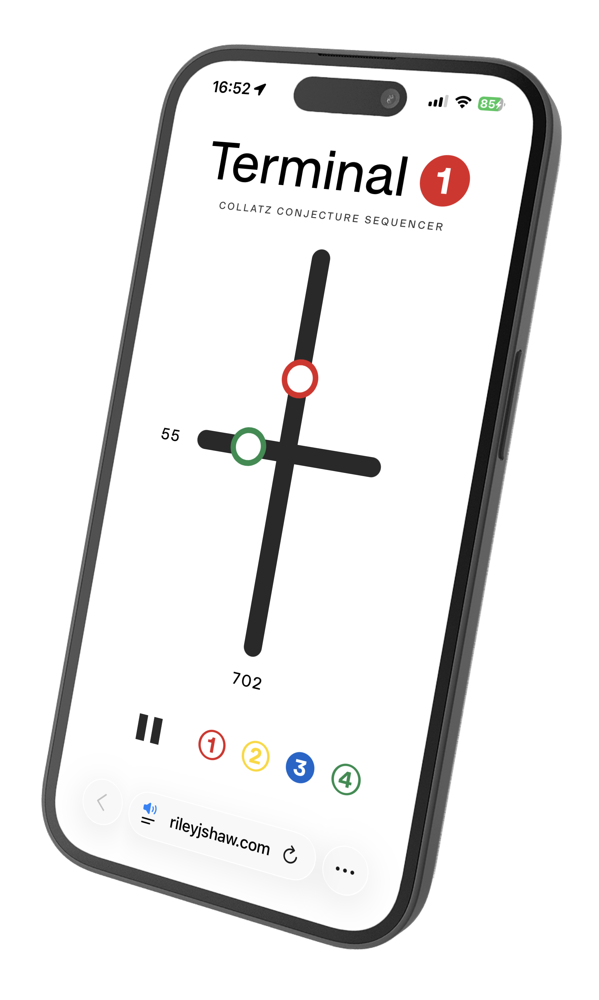

# Terminal 1

Collatz conjecture sequencer.

11 years ago, I [generated some images based on the Collatz conjecture](https://rileyjshaw.com/blog/graphing-depth). I decided to make a sequencer based on the same concept for [10,000 Drum Machines](https://10kdrummachines.com/).

## Controls

-   Horizontal slider: Tempo (beats per minute)
-   Vertical slider: Collatz sequence starting number
-   Radio buttons: Instrument preset

## License

GNU GPL v3.0
